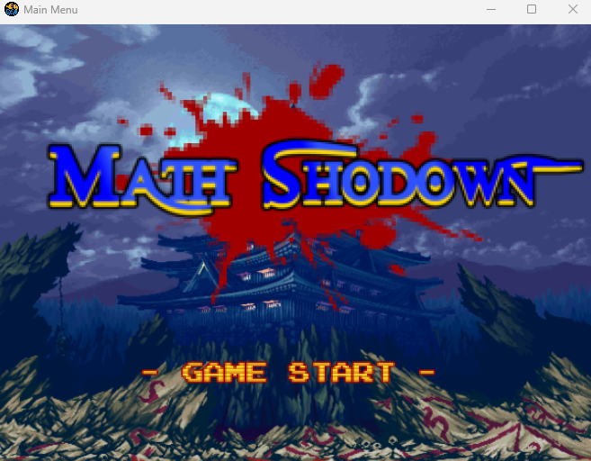
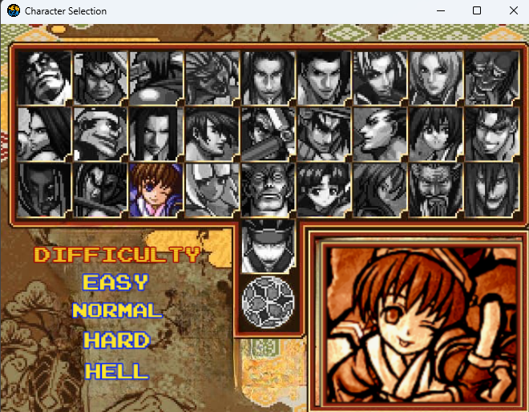
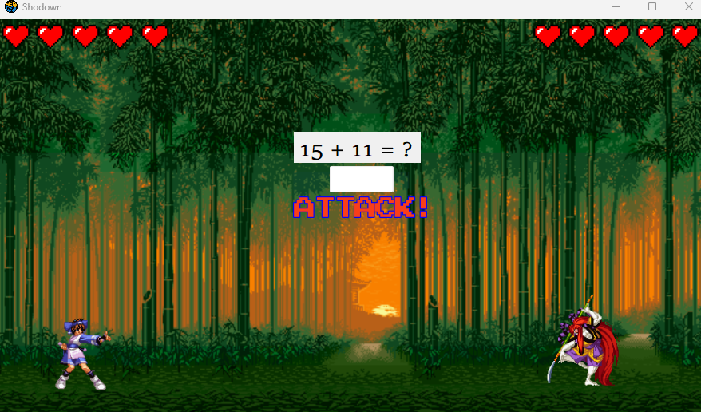
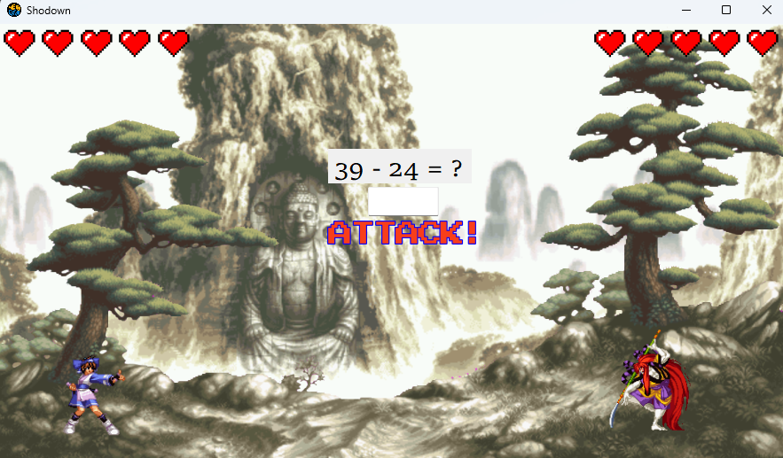
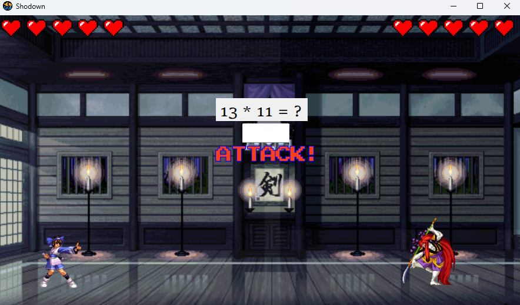
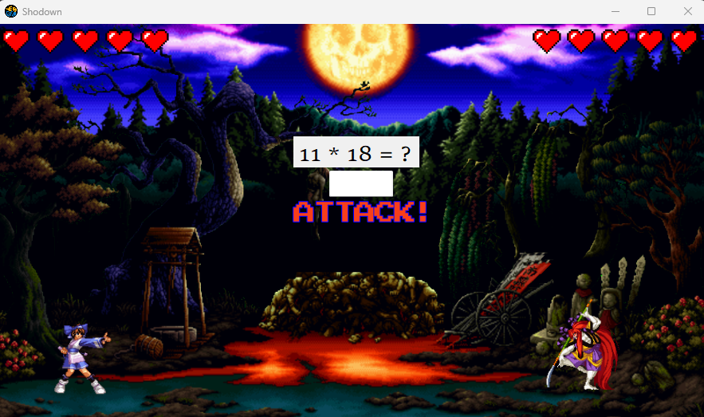
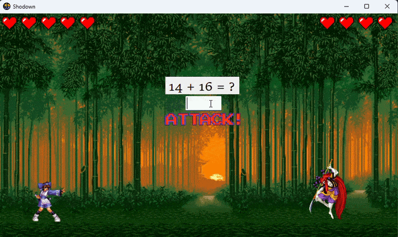
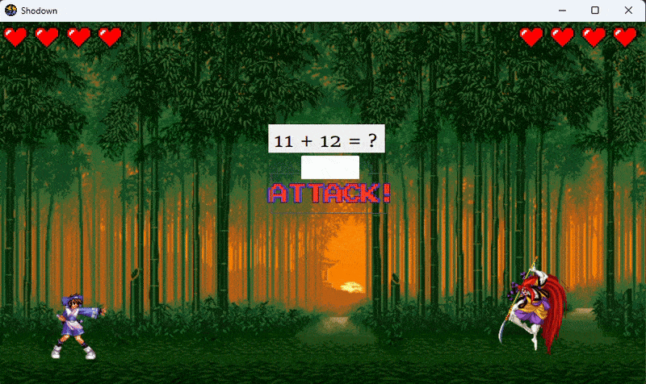

# Math Shodown ⚔️

A turn-based combat game where your math skills determine the winner! Heavily inspired by the classic fighting game *Samurai Shodown*, this project was created for a **Computer Programming 2** activity to demonstrate event-driven programming, animation through timers, and game state management in VB.NET.

---

## Gameplay & Features 🎮

-   **Turn-Based Combat**: Engage in strategic turn-based battles. A math problem will appear on screen—solve it before the timer runs out to launch an attack!
-   **Math-Powered Attacks**: Your weapon is your mind! Answer correctly, and your character attacks. Answer incorrectly or run out of time, and the enemy gets a free hit.
-   **Multiple Difficulties**: Choose from 4 difficulty levels that change the complexity of the math problems, from simple addition to challenging multiplication.
-   **Animated Characters**: Watch your character, **Rimururu**, face off against the formidable **Kyoshiro** with custom-animated attack, hit, idle, and death sequences.
-   **Health System**: Track both your health and your opponent's to claim victory in a duel of wits!

## Technology Stack 💻

-   **Language**: VB.NET
-   **Framework**: Windows Forms (.NET Framework)
-   **Assets**: Animated character sprites from SNK's *Samurai Shodown*.

## Screenshots 🖼️

Here's a walkthrough of the game's flow, from the main menu to the final knockout!

#### Main Menu & Character Selection

#### Difficulty Levels
The game features four difficulty levels, each with different types of math problems.

#### Combat Animations
Answer incorrectly or run out of time, and you'll face the consequences!

#### The Final Blow
Achieve victory with a final KO!

---

## Copyright & Disclaimer ©️

**Important: Copyright and Fair Use**

This project is a non-commercial, educational fan-work. It was created solely for the purpose of a school activity to practice and demonstrate programming skills.

All character sprites, names (Rimururu, Kyoshiro), the *Samurai Shodown* title, and the Neo Geo logo are the intellectual property of **SNK CORPORATION**, the original creators and copyright holders. This project is not affiliated with or endorsed by SNK. No copyright infringement is intended.
